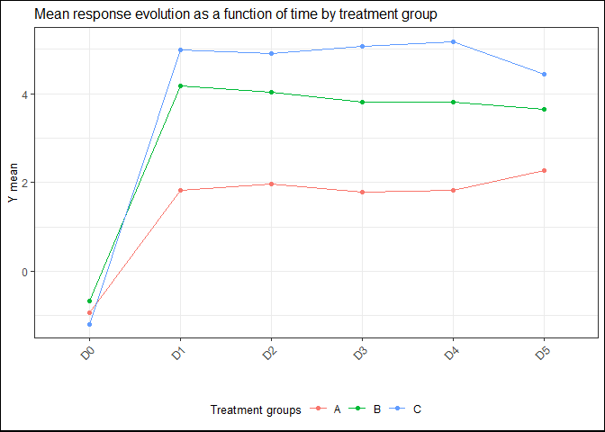

ClinReport R package
================

<!-- README.md is generated from README.Rmd. Please edit that file -->

[](https://cran.r-project.org/package=ClinReport)
[](https://www.tidyverse.org/lifecycle/#stable)


## Introduction

The aim of ClinReport is to export statistical outputs (tables and
graphics) from R to ‘Microsoft Word’ or R markdown documents in easy to
read format according to usual standards of reporting.

The formatted outputs are suitable for any publications and can be used
within the scope of clinical trials.

## Installation

You can install the released version of ClinReport from
[CRAN](https://CRAN.R-project.org) with:

``` r
install.packages("ClinReport")
```

## Basic example

``` r

library(ClinReport)
library(officer)
library(flextable)

# Load data

data(data)

# Descriptive statistics (Numerical response and 2 explicative variables):

tab1=report.quanti(data=data,y="y_numeric",
        x1="GROUP",x2="TIMEPOINT",at.row="TIMEPOINT",subjid="SUBJID")
tab1
#> 
#> ############################################
#> Quantitative descriptive statistics of: y_numeric
#> ############################################
#> 
#>    TIMEPOINT Statistics      A (N=30)      B (N=21)      C (N=17)
#> 1         D0          N            30            20            16
#> 2         D0  Mean (SD)   -0.93(0.86)   -0.67(1.09)   -1.19(0.92)
#> 3         D0     Median         -0.82         -0.69         -1.26
#> 4         D0    [Q1;Q3] [-1.59;-0.16] [-1.39;-0.06] [-1.62;-0.83]
#> 5         D0  [Min;Max]  [-2.34;0.36]  [-2.44;2.10]  [-2.99;0.66]
#> 6         D0    Missing             1             1             0
#> 7                                                                
#> 8         D1          N            30            20            16
#> 9         D1  Mean (SD)    1.83(1.04)    4.17(1.28)    4.98(0.69)
#> 10        D1     Median          1.78          4.19          5.08
#> 11        D1    [Q1;Q3] [ 0.94; 2.54] [ 3.23; 4.92] [ 4.58; 5.46]
#> 12        D1  [Min;Max]  [ 0.11;3.88]  [ 1.48;6.19]  [ 3.80;6.23]
#> 13        D1    Missing             1             0             0
#> 14                                                               
#> 15        D2          N            30            20            16
#> 16        D2  Mean (SD)    1.97(1.17)    4.04(0.89)    4.90(1.36)
#> 17        D2     Median          1.66          4.19          5.06
#> 18        D2    [Q1;Q3] [ 1.23; 2.86] [ 3.62; 4.36] [ 4.34; 5.20]
#> 19        D2  [Min;Max]  [-0.18;4.36]  [ 2.03;5.63]  [ 2.39;7.96]
#> 20        D2    Missing             1             1             0
#> 21                                                               
#> 22        D3          N            30            20            16
#> 23        D3  Mean (SD)    1.78(1.17)    3.81(0.94)    5.07(1.12)
#> 24        D3     Median          1.78          3.63          5.22
#> 25        D3    [Q1;Q3] [ 0.93; 2.42] [ 3.13; 4.44] [ 4.11; 5.66]
#> 26        D3  [Min;Max]  [-0.16;3.90]  [ 2.46;6.01]  [ 3.16;7.37]
#> 27        D3    Missing             0             1             1
#> 28                                                               
#> 29        D4          N            30            20            16
#> 30        D4  Mean (SD)    1.83(0.85)    3.80(0.95)    5.17(1.03)
#> 31        D4     Median          1.67          3.83          4.88
#> 32        D4    [Q1;Q3] [ 1.26; 2.32] [ 3.12; 4.42] [ 4.69; 5.50]
#> 33        D4  [Min;Max]  [ 0.38;3.97]  [ 2.31;5.41]  [ 3.24;6.96]
#> 34        D4    Missing             1             1             1
#> 35                                                               
#> 36        D5          N            30            20            16
#> 37        D5  Mean (SD)    2.27(1.20)    3.64(1.19)    4.43(0.98)
#> 38        D5     Median          2.50          3.86          4.57
#> 39        D5    [Q1;Q3] [ 1.77; 3.21] [ 2.59; 4.60] [ 3.44; 4.97]
#> 40        D5  [Min;Max]  [-1.19;4.31]  [ 0.91;5.12]  [ 2.95;6.54]
#> 41        D5    Missing             0             0             0
#> 
#> ############################################

# You can have the corresponding graphic:

gg=plot(tab1,title="Mean response evolution as a function of time by treatment group",
 legend.label="Treatment groups",ylab="Y mean")
gg
```



# Put the results in a Microsoft Word or a R markdown document with officer

``` r

doc=read_docx()
doc=report.doc(tab1,title="Example of a quantitative descriptive table",doc=doc) 

# See the results

file=paste(tempfile(),".docx",sep="")
print(doc, target =file)

#shell.exec(file)
```
